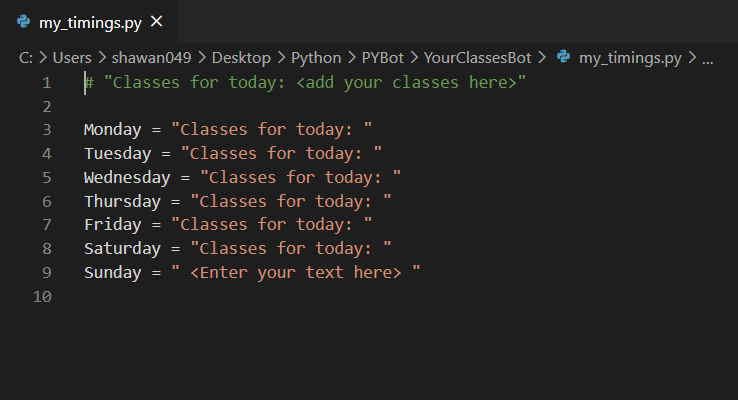
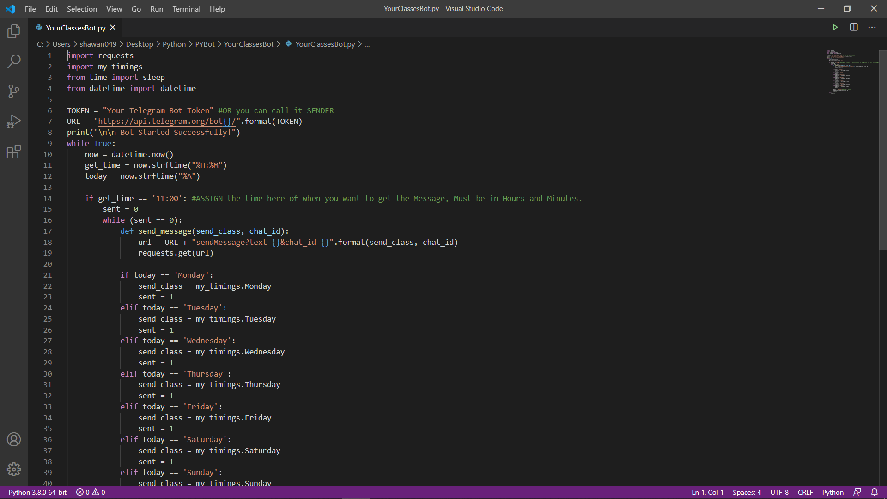

# YourClassesBot

**YourClassesBot** is a Python Automation Script that can access your timetable from a file named "my_timetable.py" and send you text alert on telegram about your classes. This can be real handy, if you don't wanna check your timetables daily.

## Required Packages

Import the packages.

```bash
import requests
from time import sleep
from datetime import datetime
```

## Add your timetable
You need to add your timetable to the file named "my_timings.py"


## Usage

```python
import my_timings

TOKEN = "Your Telegram Bot Token" #Enter your Telegram Bot Token Here.
...
if get_time == '11:00': #Enter the time you want to get the alerts
...
chat_id = "Chat ID" # Alert RECEIVER's Chat ID
```
And you're good to go! You can also deploy your script to cloud and get alerts forever.



## Contributing
Pull requests are welcome. For major changes, please open an issue first to discuss what you would like to change.

Please make sure to update tests as appropriate.

## License
**N/A**\
The code is free to copy and you can use it as the way you like. Thanks for viewing my work.
